# Jarkom-Modul-4-A02-2022
Kelompok A02
+ Ferdinand Putra Gumilang Silalahi - 5025201176
+ Naufal Adli Purnama - 5025201195
+ Bimantara Tito Wahyudi - 5025201227

## Soal
### Topologi

## VLSM - CPT

### Penghitungan IP

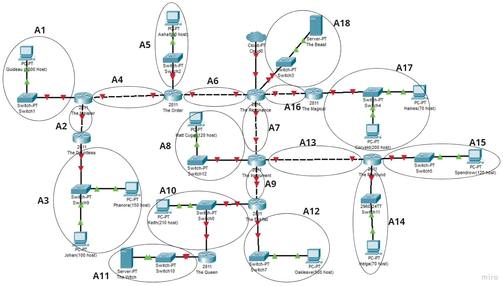

Setelah dihitung jumlah IP dari subnet-subnet di atas, didapat tabel berikut

Subnet | Jumlah IP | Netmask
:---: | :---: | :---:
A1|1001|/22
A2|2|/30
A3|251|/24
A4|2|/30
A5|51|/26
A6|2|/30
A7|2|/30
A8|121|/25
A9|2|/30
A10|212|/24
A11|2|/30
A12|501|/23
A13|2|/30
A14|71|/25
A15|121|/25
A16|2|/30
A17|271|/23
A18|2|/30
Total|2618|/20

Kemudian dibentuk pohon IP dengan `10.0.0.0 /20` sebagai rootnya

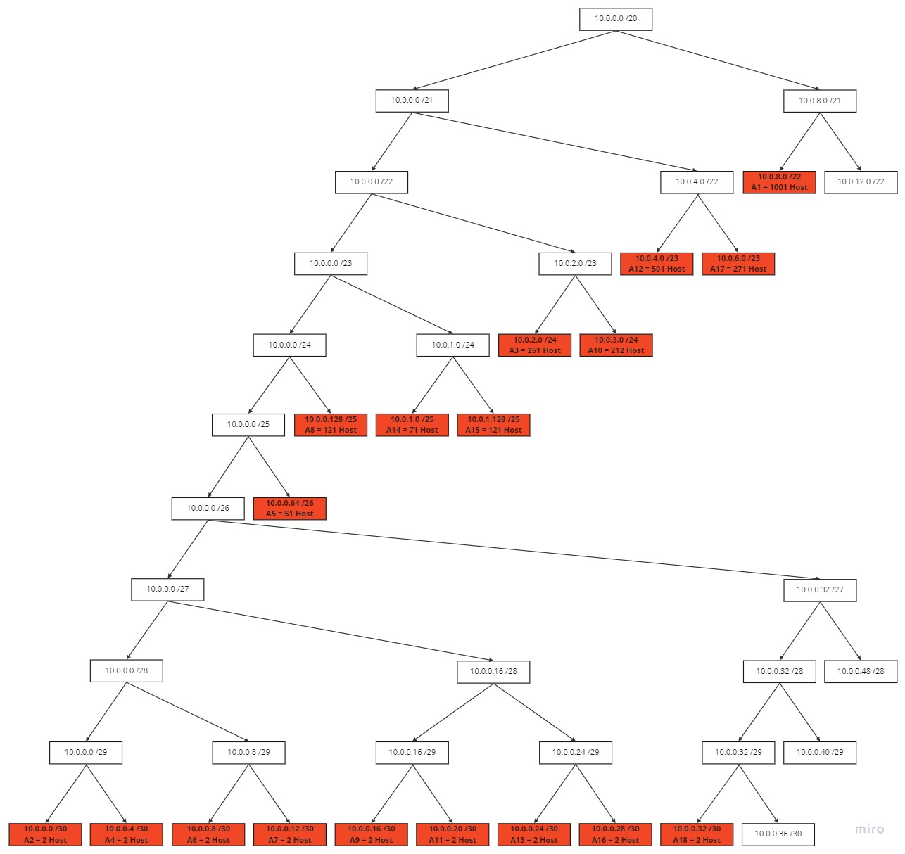

Dari pohon IP tersebut, didapat NID dan Netmask setiap subnet

| Subnet | Network ID |     Netmask     |
| :----: | :--------: | :-------------: |
|   A1   |  10.0.8.0  |  255.255.252.0  |
|   A2   |  10.0.0.0  | 255.255.255.252 |
|   A3   |  10.0.2.0  |  255.255.255.0  |
|   A4   |  10.0.0.4  | 255.255.255.252 |
|   A5   | 10.0.0.64  | 255.255.255.192 |
|   A6   |  10.0.0.8  | 255.255.255.252 |
|   A7   | 10.0.0.12  | 255.255.255.252 |
|   A8   | 10.0.0.128 | 255.255.255.128 |
|   A9   | 10.0.0.16  | 255.255.255.252 |
|  A10   |  10.0.3.0  |  255.255.255.0  |
|  A11   | 10.0.0.20  | 255.255.255.252 |
|  A12   |  10.0.4.0  |  255.255.254.0  |
|  A13   | 10.0.0.24  | 255.255.255.252 |
|  A14   |  10.0.1.0  | 255.255.255.128 |
|  A15   | 10.0.1.128 | 255.255.255.128 |
|  A16   | 10.0.0.28  | 255.255.255.252 |
|  A17   |  10.0.6.0  |  255.255.254.0  |
|  A18   | 10.0.0.32  | 255.255.255.252 |


### Subnetting

Setelah dihitung ip untuk tiap subnet, maka sekarang saatnya mengatur ip pada tiap router, client dan server. Setiap interface node diatur sesuai ip yang telah dihitung melalui GUI aplikasi.

#### The Resonance

```
FastEthernet0/0 
FastEthernet0/1 10.0.0.29 255.255.255.252
Ethernet0/3/0 10.0.0.9 255.255.255.252
FastEthernet1/0 10.0.0.33 255.255.255.252
FastEthernet1/1 10.0.0.13 255.255.255.252
```

#### The Order

```
FastEthernet0/0 10.0.0.10 255.255.255.252
FastEthernet0/1 10.0.0.65 255.255.255.192
FastEthernet1/0 10.0.0.5 255.255.255.252
FastEthernet1/1
```

#### The Minister

```
FastEthernet0/0 10.0.0.6 255.255.255.252
FastEthernet0/1 10.0.8.1 255.255.252.0
FastEthernet1/0 10.0.0.1 255.255.255.252
FastEthernet1/1
```

#### The DauntLess

```
FastEthernet0/0 10.0.0.2 255.255.255.252
FastEthernet0/1 10.0.2.1 255.255.255.0
```

#### The Intrument

```
FastEthernet0/0 10.0.0.14 255.255.255.252
FastEthernet0/1 10.0.0.129 255.255.255.128
FastEthernet1/0 10.0.0.17 255.255.255.252
FastEthernet1/1 10.0.0.25 255.255.255.252
```

#### The Firefist

```
FastEthernet0/0 10.0.0.18 255.255.255.252
FastEthernet0/1 10.0.3.1 255.255.255.0
FastEthernet1/0 10.0.4.1 255.255.254.0
FastEthernet1/1
```

#### The Queen

```
FastEthernet0/0 10.0.3.2 255.255.255.0
FastEthernet0/1 10.0.0.21 255.255.255.252
```

#### The Profound

```
FastEthernet0/0 10.0.0.26 255.255.255.252
FastEthernet0/1 10.0.1.129 255.255.255.128
FastEthernet1/0 10.0.1.1 255.255.255.128
FastEthernet1/1
```

#### The Magical

```
FastEthernet0/0 10.0.0.30 255.255.255.252
FastEthernet0/1 10.0.6.1 255.255.254.0
FastEthernet1/0
FastEthernet1/1
```

#### Johan

```
FastEthernet0 10.0.2.2 255.255.255.0
Default Gateway 10.0.2.1
```

#### Phanora

```
FastEthernet0 10.0.2.3 255.255.255.0
Default Gateway 10.0.2.1
```

#### Guideau

```
FastEthernet0 10.0.8.2 255.255.252.0
Default Gateway 10.0.8.1
```

#### Ashaf

```
FastEthernet0 10.0.0.66 255.255.255.192
Default Gateway 10.0.0.65
```

#### The Witch

```
FastEthernet0 10.0.0.22 255.255.255.252
Default Gateway 10.0.0.21
```

#### Keith

```
FastEthernet0 10.0.3.3 255.255.255.0
Default Gateway 10.0.3.1
```

#### Oakleave

```
FastEthernet0 10.0.4.2 255.255.254.0
Default Gateway 10.0.4.1
```

#### Matt Cugat

```
FastEthernet0 10.0.0.130 255.255.255.128
Default Gateway 10.0.0.129
```

#### Helga

```
FastEthernet0 10.0.1.2 255.255.255.128
Default Gateway 10.0.1.1
```

#### Spendrow

```
FastEthernet0 10.0.1.130 255.255.255.128
Default Gateway 10.0.1.129
```

#### Corvekt

```
FastEthernet0 10.0.6.3 255.255.254.0
Default Gateway 10.0.6.1
```

#### Haines

```
FastEthernet0 10.0.6.2 255.255.254.0
Default Gateway 10.0.6.1
```

#### The Beast

```
FastEthernet0 10.0.0.34 255.255.255.252
Default Gateway 10.0.0.33
```

### Routing

Setelah pengaturan IP selesai, dilanjutkan dengan routing pada router-router seperti berikut.

#### The Resonance

```
ip route 10.0.6.0 255.255.254.0 10.0.0.30
ip route 10.0.3.0 255.255.255.0 10.0.0.14
ip route 10.0.0.20 255.255.255.252 10.0.0.14
ip route 10.0.0.128 255.255.255.128 10.0.0.14
ip route 10.0.4.0 255.255.254.0 10.0.0.14
ip route 10.0.0.16 255.255.255.252 10.0.0.14
ip route 10.0.0.24 255.255.255.252 10.0.0.14
ip route 10.0.1.128 255.255.255.128 10.0.0.14
ip route 10.0.1.0 255.255.255.128 10.0.0.14
ip route 10.0.0.64 255.255.255.192 10.0.0.10
ip route 10.0.8.0 255.255.252.0 10.0.0.10
ip route 10.0.2.0 255.255.255.0 10.0.0.10
ip route 10.0.0.0 255.255.255.252 10.0.0.10
ip route 10.0.0.4 255.255.255.252 10.0.0.10
```

#### The Order

```
ip route 0.0.0.0 0.0.0.0 10.0.0.9
ip route 10.0.8.0 255.255.252.0 10.0.0.6
ip route 10.0.2.0 255.255.255.0 10.0.0.6
ip route 10.0.0.0 255.255.255.252 10.0.0.6
ip route 10.0.0.4 255.255.254.252 10.0.0.6
```

#### The Minister

```
ip route 0.0.0.0 0.0.0.0 10.0.0.5
ip route 10.0.2.0 255.255.255.0 10.0.0.2
```

#### The DauntLess

```
ip route 0.0.0.0 0.0.0.0 10.0.0.1
```

#### The Intrument

```
ip route 0.0.0.0 0.0.0.0 10.0.0.13
ip route 10.0.3.0 255.255.255.0 10.0.0.18
ip route 10.0.0.20 255.255.255.252 10.0.0.18
ip route 10.0.4.0 255.255.254.0 10.0.0.18
ip route 10.0.0.16 255.255.255.252 10.0.0.18
ip route 10.0.0.24 255.255.255.252 10.0.0.26
ip route 10.0.1.128 255.255.255.128 10.0.0.26
ip route 10.0.1.0 255.255.255.128 10.0.0.26
```

#### The Firefist

```
ip route 0.0.0.0 0.0.0.0 10.0.0.17
ip route 10.0.0.20 255.255.255.252 10.0.3.2
```

#### The Queen

```
ip route 0.0.0.0 0.0.0.0 10.0.3.1
```

#### The Profound

```
ip route 0.0.0.0 0.0.0.0 10.0.0.25
```

#### The Magical

```
ip route 0.0.0.0 0.0.0.0 10.0.0.29
```

### Tes Ping

1. Ping `The Dauntless` to `The Profound`
    

2. Ping `Guideau` to `The Firefist`
    

3. Ping `The Witch` to `The Order`
    

4. Ping `Helga` to `Phanora`
    

5. Ping `The Beast` to `The Instrument`
    

6. Ping `The Witch` to `The Beast`
    

7. Ping `Matt Cugatt` to `Corvekt`
    

8. Ping `The Beast` to `Spendrow`
    

9. Ping `Haines` to `Keith`
    

10. Ping `Johan` to `Queen`
    

11. Ping `Oakleave` to `The Witch`
    

12. Ping `Ashaf` to `The Resonance`
    

13. Ping `Corvekt` to `The Minister`
    

14. Ping `Guideau` to `Helga`
    

15. Ping `Ashaf` to `The Queen`
    


## Kendala

## CIDR - GNS3

### Penggabungan Subnet

Berikut penggabungan subnet dengan metode CIDR dimulai dari subnet terjauh


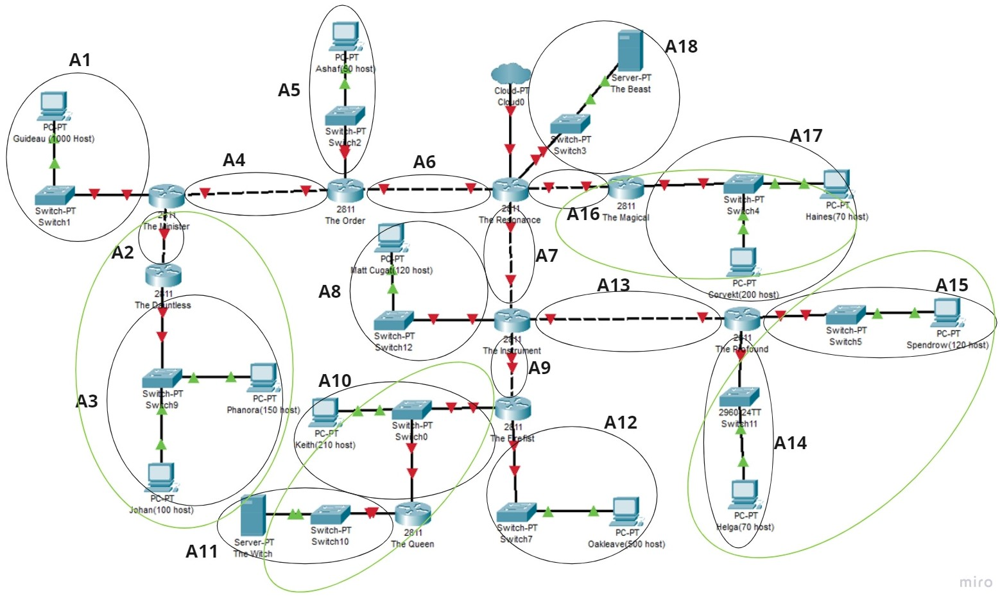
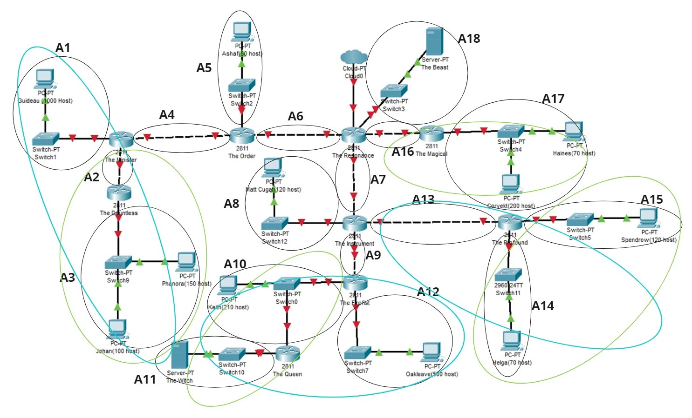
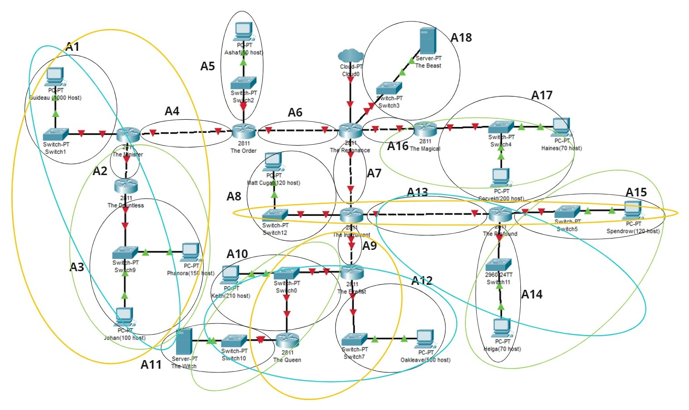
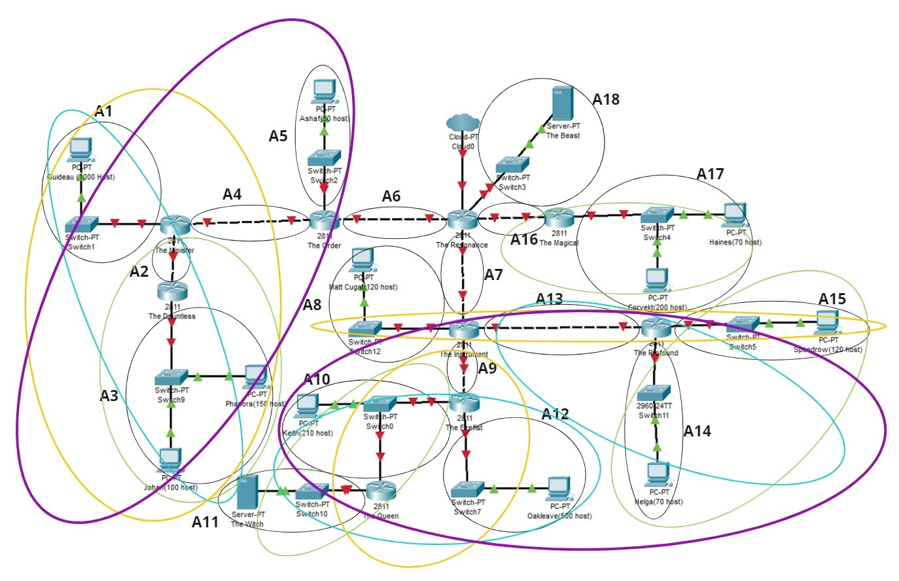
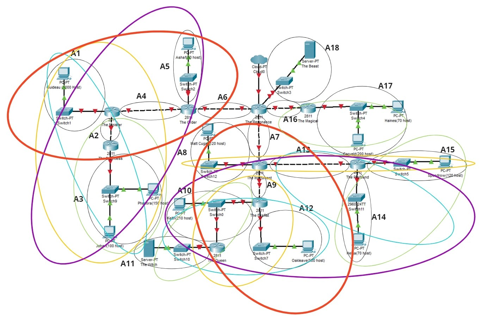
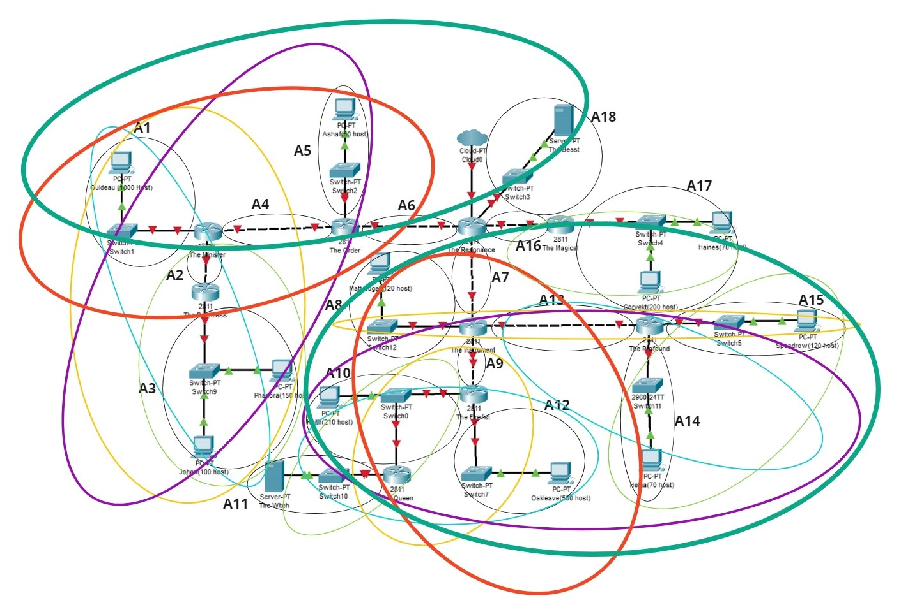
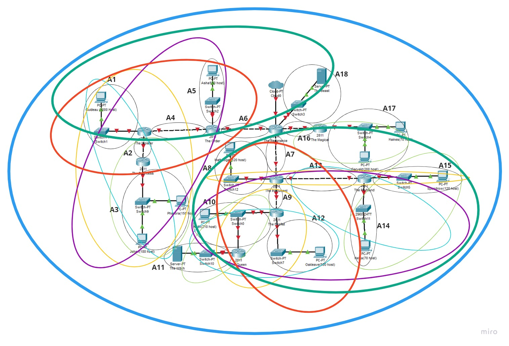

### Penghitungan IP

Berikut pohon subnet yang dibentuk sesuai dengan penggabungan subnet sebelumnya

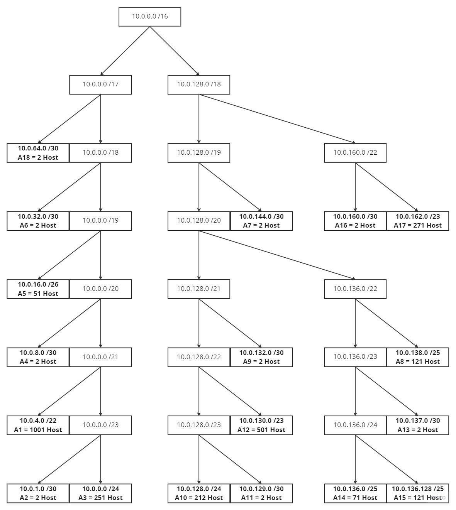

Didapat tabel data setiap subnet, yakni NID dan Netmask

Subnet | Network ID | Netmask
:---: | :---: | :---:
A1|10.0.4.0|255.255.252.0
A2|10.0.1.0|255.255.255.252
A3|10.0.0.0|255.255.255.0
A4|10.0.8.0|255.255.255.252
A5|10.0.16.0|255.255.255.192
A6|10.0.32.0|255.255.255.252
A7|10.0.144.0|255.255.255.252
A8|10.0.138.0|255.255.255.128
A9|10.0.132.0|255.255.255.252
A10|10.0.128.0|255.255.255.0
A11|10.0.129.0|255.255.255.252
A12|10.0.130.0|255.255.254.0
A13|10.0.137.0|255.255.255.252
A14|10.0.136.0|255.255.255.128
A15|10.0.136.128|255.255.255.128
A16|10.0.160.0|255.255.255.252
A17|10.0.162.0|255.255.254.0
A18|10.0.64.0|255.255.255.252


### Topologi GNS3

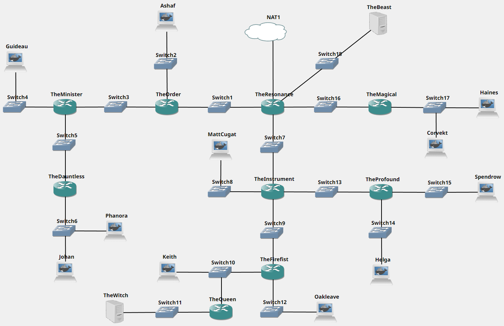

### Subnetting

Setelah dihitung ip untuk tiap subnet, maka sekarang saatnya mengatur ip pada tiap router, client dan server. Setiap interface node diatur sesuai ip yang telah dihitung dengan mengedit file `/etc/network/interfaces`. Setelah itu, jalankan command `iptables -t nat -A POSTROUTING -o eth0 -j MASQUERADE -s 10.0.0.0/16` untuk router `The Resonance` dan command `echo nameserver 192.168.122.1 > /etc/resolv.conf` untuk semua node lainnya. Command tersebut kemudian disimpan dalam `.bashrc` untuk otomasi.

#### The Resonance

```
auto eth0
iface eth0 inet dhcp
auto eth1
iface eth1 inet static
	address 10.0.32.1
	netmask 255.255.255.252
auto eth2
iface eth2 inet static
	address 10.0.144.1
	netmask 255.255.255.252
auto eth3
iface eth3 inet static
	address 10.0.160.1
	netmask 255.255.255.252
auto eth4
iface eth4 inet static
	address 10.0.64.1
	netmask 255.255.255.252
```

#### The Order

```
auto eth0
iface eth0 inet static
	address 10.0.32.2
	netmask 255.255.255.252
auto eth1
iface eth1 inet static
	address 10.0.16.1
	netmask 255.255.255.192
auto eth2
iface eth2 inet static
	address 10.0.8.1
	netmask 255.255.255.252
```

#### The Minister

```
auto eth0
iface eth0 inet static
	address 10.0.8.2
	netmask 255.255.255.252
auto eth1
iface eth1 inet static
	address 10.0.4.1
	netmask 255.255.252.0
auto eth2
iface eth2 inet static
	address 10.0.1.1
	netmask 255.255.255.252
```

#### The DauntLess

```
auto eth0
iface eth0 inet static
	address 10.0.1.2
	netmask 255.255.255.252
auto eth1
iface eth1 inet static
	address 10.0.0.1
	netmask 255.255.255.0
```

#### The Intrument

```
auto eth0
iface eth0 inet static
	address 10.0.144.2
	netmask 255.255.255.252
auto eth1
iface eth1 inet static
	address 10.0.138.1
	netmask 255.255.255.128
auto eth2
iface eth2 inet static
	address 10.0.132.1
	netmask 255.255.255.252
auto eth3
iface eth3 inet static
	address 10.0.137.1
	netmask 255.255.255.252
```

#### The Firefist

```
auto eth0
iface eth0 inet static
	address 10.0.132.2
	netmask 255.255.255.252
auto eth1
iface eth1 inet static
	address 10.0.128.1
	netmask 255.255.255.0
auto eth2
iface eth2 inet static
	address 10.0.130.1
	netmask 255.255.254.0
```

#### The Queen

```
auto eth0
iface eth0 inet static
	address 10.0.128.2
	netmask 255.255.255.0
auto eth1
iface eth1 inet static
	address 10.0.129.1
	netmask 255.255.255.252
```

#### The Profound

```
auto eth0
iface eth0 inet static
	address 10.0.137.2
	netmask 255.255.255.252
auto eth1
iface eth1 inet static
	address 10.0.136.1
	netmask 255.255.255.128
auto eth2
iface eth2 inet static
	address 10.0.136.129
	netmask 255.255.255.128
```

#### The Magical

```
auto eth0
iface eth0 inet static
	address 10.0.160.2
	netmask 255.255.255.252
auto eth1
iface eth1 inet static
	address 10.0.162.1
	netmask 255.255.254.0
```

#### Johan

```
auto eth0
iface eth0 inet static
	address 10.0.0.2
	netmask 255.255.255.0
	gateway 10.0.0.1
```

#### Phanora

```
auto eth0
iface eth0 inet static
	address 10.0.0.3
	netmask 255.255.255.0
	gateway 10.0.0.1
```

#### Guideau

```
auto eth0
iface eth0 inet static
	address 10.0.4.2
	netmask 255.255.252.0
	gateway 10.0.4.1
```

#### Ashaf

```
auto eth0
iface eth0 inet static
	address 10.0.16.2
	netmask 255.255.255.192
	gateway 10.0.16.1
```

#### The Witch

```
auto eth0
iface eth0 inet static
	address 10.0.129.2
	netmask 255.255.255.252
	gateway 10.0.129.1
```

#### Keith

```
auto eth0
iface eth0 inet static
	address 10.0.128.2
	netmask 255.255.255.0
	gateway 10.0.128.1
```

#### Oakleave

```
auto eth0
iface eth0 inet static
	address 10.0.130.2
	netmask 255.255.254.0
	gateway 10.0.130.1
```

#### Matt Cugat

```
auto eth0
iface eth0 inet static
	address 10.0.138.2
	netmask 255.255.255.128
	gateway 10.0.138.1
```

#### Helga

```
auto eth0
iface eth0 inet static
	address 10.0.136.2
	netmask 255.255.255.128
	gateway 10.0.136.1
```

#### Spendrow

```
auto eth0
iface eth0 inet static
	address 10.0.136.130
	netmask 255.255.255.128
	gateway 10.0.136.129
```

#### Corvekt

```
auto eth0
iface eth0 inet static
	address 10.0.162.2
	netmask 255.255.254.0
	gateway 10.0.162.1
```

#### Haines

```
auto eth0
iface eth0 inet static
	address 10.0.162.3
	netmask 255.255.254.0
	gateway 10.0.162.1
```

#### The Beast

```
auto eth0
iface eth0 inet static
	address 10.0.64.2
	netmask 255.255.255.252
	gateway 10.0.64.1
```

### Routing

Setelah pengaturan IP selesai, dilanjutkan dengan routing. Semua router menjalankan command route sesuai posisi dalam topologi. Command route ini kemudian disimpan dalam `.bashrc` untuk otomasi.

#### The Resonance

```
route add -net 10.0.4.0 netmask 255.255.252.0 gw 10.0.32.2
route add -net 10.0.1.0 netmask 255.255.255.252 gw 10.0.32.2
route add -net 10.0.0.0 netmask 255.255.255.0 gw 10.0.32.2
route add -net 10.0.8.0 netmask 255.255.255.252 gw 10.0.32.2
route add -net 10.0.16.0 netmask 255.255.255.192 gw 10.0.32.2
route add -net 10.0.138.0 netmask 255.255.255.128 gw 10.0.144.2
route add -net 10.0.132.0 netmask 255.255.255.252 gw 10.0.144.2
route add -net 10.0.128.0 netmask 255.255.255.0 gw 10.0.144.2
route add -net 10.0.129.0 netmask 255.255.255.252 gw 10.0.144.2
route add -net 10.0.130.0 netmask 255.255.254.0 gw 10.0.144.2
route add -net 10.0.137.0 netmask 255.255.255.252 gw 10.0.144.2
route add -net 10.0.136.0 netmask 255.255.255.128 gw 10.0.144.2
route add -net 10.0.136.128 netmask 255.255.255.128 gw 10.0.144.2
route add -net 10.0.162.0 netmask 255.255.254.0 gw 10.0.160.2
```

#### The Order

```
route add -net 0.0.0.0 netmask 0.0.0.0 gw 10.0.32.1
route add -net 10.0.4.0 netmask 255.255.252.0 gw 10.0.8.2
route add -net 10.0.1.0 netmask 255.255.255.252 gw 10.0.8.2
route add -net 10.0.0.0 netmask 255.255.255.0 gw 10.0.8.2
```

#### The Minister

```
route add -net 0.0.0.0 netmask 0.0.0.0 gw 10.0.8.1
route add -net 10.0.0.0 netmask 255.255.255.0 gw 10.0.1.2
```

#### The DauntLess

```
route add -net 0.0.0.0 netmask 0.0.0.0 gw 10.0.1.1
```

#### The Intrument

```
route add -net 0.0.0.0 netmask 0.0.0.0 gw 10.0.144.1
route add -net 10.0.128.0 netmask 255.255.255.0 gw 10.0.132.2
route add -net 10.0.129.0 netmask 255.255.255.252 gw 10.0.132.2
route add -net 10.0.130.0 netmask 255.255.254.0 gw 10.0.132.2
route add -net 10.0.136.0 netmask 255.255.255.128 gw 10.0.137.2
route add -net 10.0.136.128 netmask 255.255.255.128 gw 10.0.137.2
```

#### The Firefist

```
route add -net 0.0.0.0 netmask 0.0.0.0 gw 10.0.132.1
route add -net 10.0.129.0 netmask 255.255.255.252 gw 10.0.128.2

```

#### The Queen

```
route add -net 0.0.0.0 netmask 0.0.0.0 gw 10.0.128.1
```

#### The Profound

```
route add -net 0.0.0.0 netmask 0.0.0.0 gw 10.0.137.1
```

#### The Magical

```
route add -net 0.0.0.0 netmask 0.0.0.0 gw 10.0.160.1
```

### Tes Ping

Ping `Guideau` to `The Witch`

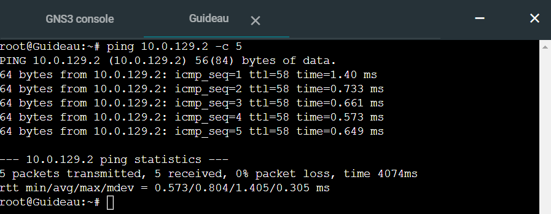

Ping  `Guideau` to `google.com`

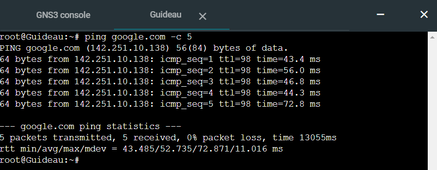

## Kendala
